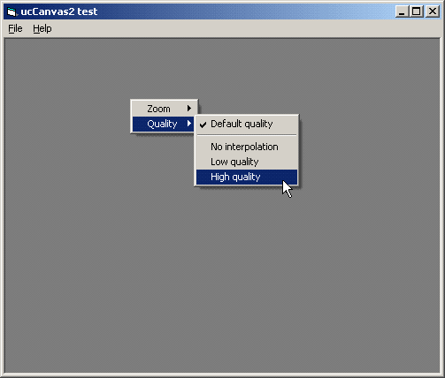



## ucCanvas 2\.0 \- High\-quality image previewing

### Description

ucCanvas2 user control: High-quality image previewing (w/ zooming+scrolling) through GDI+.

If you don't have XP or Win2k SP3 then you must install GDI+ dll: http://www.microsoft.com/downloads/release.asp?releaseid=32738. 

----

Zip 11Kb
 
### More Info
 

             |
---                |---
**Submitted On**   |2003-11-05 12:09:18
**By**             |[Carles P\.V\.](https://github.com/Planet-Source-Code/PSCIndex/blob/master/ByAuthor/carles-p-v.md)
**Level**          |Intermediate
**User Rating**    |5.0 (15 globes from 3 users)
**Compatibility**  |VB 6\.0
**Category**       |[Custom Controls/ Forms/  Menus](https://github.com/Planet-Source-Code/PSCIndex/blob/master/ByCategory/custom-controls-forms-menus__1-4.md)
**World**          |[Visual Basic](https://github.com/Planet-Source-Code/PSCIndex/blob/master/ByWorld/visual-basic.md)
**Archive File**   |[ucCanvas\_21763036282004\.zip](https://github.com/Planet-Source-Code/carles-p-v-uccanvas-2-0-high-quality-image-previewing__1-46660/archive/master.zip)

